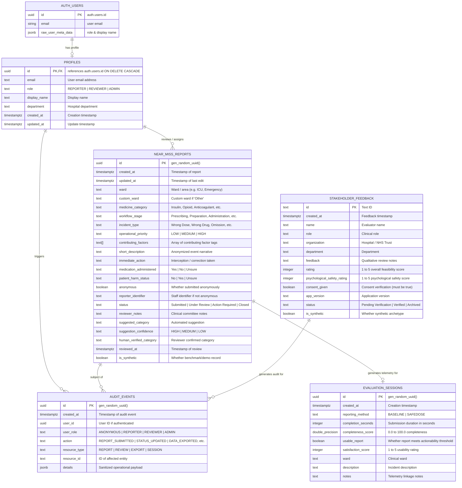

# SafeDose Database Schema & RLS Security Specification

**Project:** SafeDose NearMiss (`barani-39/safedose-nearmiss`)  
**Database Engine:** PostgreSQL 15+ (Hosted on Supabase)  
**Security Model:** Mandatory PostgreSQL Row Level Security (RLS) on all public tables  
**Migration Path:** `supabase/migrations/` (5 declarative SQL migration files)  

---

## 1. Entity-Relationship Diagram (ERD)

---

## 2. Table Specifications

### 2.1. `near_miss_reports`
- **Migration:** `20260824062123_create_reports_table.sql` & `20260930000002_harden_rls_security.sql`
- **Purpose:** Primary repository for near-miss medication incident reports submitted across hospital wards.
- **Columns:**

| Column | Type | Nullable | Default | Constraints | Description |
|:---|:---|:---:|:---|:---|:---|
| `id` | `uuid` | NO | `gen_random_uuid()` | Primary Key | Unique incident identifier |
| `created_at` | `timestamptz` | NO | `now()` | — | Submission timestamp |
| `updated_at` | `timestamptz` | NO | `now()` | — | Last modification timestamp |
| `ward` | `text` | NO | — | — | Hospital ward (ICU, Emergency, etc.) |
| `custom_ward` | `text` | YES | `NULL` | — | Custom name when ward is "Other" |
| `medicine_category` | `text` | NO | — | — | Therapeutic category (Insulin, Opioid, etc.) |
| `workflow_stage` | `text` | NO | — | — | Medication lifecycle stage |
| `incident_type` | `text` | NO | — | — | Incident classification |
| `operational_priority` | `text` | NO | — | `IN ('LOW', 'MEDIUM', 'HIGH')` | Triage priority (not clinical diagnosis) |
| `contributing_factors` | `text[]` | NO | `'{}'` | — | Systemic contributing tags |
| `short_description` | `text` | NO | — | — | Anonymized near-miss narrative |
| `immediate_action` | `text` | YES | `NULL` | — | Interception action taken |
| `medication_administered` | `text` | NO | — | `IN ('Yes', 'No', 'Unsure')` | Administration status |
| `patient_harm_status` | `text` | NO | — | `IN ('No', 'Yes', 'Unsure')` | Zero-harm boundary indicator |
| `anonymous` | `boolean` | NO | `true` | — | Default-on anonymity flag |
| `reporter_identifier` | `text` | YES | `NULL` | — | Optional staff identifier if not anonymous |
| `status` | `text` | NO | `'Submitted'` | `IN ('Submitted', 'Under Review', 'Action Required', 'Closed')` | Review queue lifecycle |
| `reviewer_notes` | `text` | YES | `NULL` | — | Notes added by safety committee |
| `suggested_category` | `text` | YES | `NULL` | — | Automated classification prediction |
| `suggestion_confidence` | `text` | YES | `NULL` | — | Classifier confidence level |
| `human_verified_category` | `text` | YES | `NULL` | — | Confirmed category by clinician |
| `reviewed_at` | `timestamptz` | YES | `NULL` | — | Review completion timestamp |
| `is_synthetic` | `boolean` | NO | `false` | — | True for benchmark/demonstration cases |

- **Indexes:**
  - `idx_reports_created_at`: `(created_at DESC)`
  - `idx_reports_status`: `(status)`
  - `idx_reports_priority`: `(operational_priority)`
  - `idx_reports_ward`: `(ward)`

- **Row Level Security (RLS) Policies:**
  - `anon_select_reports` (`SELECT`): `USING (true)` — All users can read reports for clinical learning and dashboard analytics.
  - `anon_insert_reports` (`INSERT`): `WITH CHECK (true)` — Anonymous staff and reporters can insert reports freely.
  - `reviewers_admins_update_reports` (`UPDATE`): Restricted to authenticated users whose `profiles.role IN ('REVIEWER', 'ADMIN')`.
  - `admins_delete_reports` (`DELETE`): Restricted strictly to authenticated `ADMIN` users.

---

### 2.2. `evaluation_sessions`
- **Migration:** `20260824062146_create_evaluation_table.sql` & `20260930000002_harden_rls_security.sql`
- **Purpose:** Stores comparative telemetry data contrasting Baseline (traditional narrative form) vs SafeDose (structured form) reporting.
- **Columns:**

| Column | Type | Nullable | Default | Constraints | Description |
|:---|:---|:---:|:---|:---|:---|
| `id` | `uuid` | NO | `gen_random_uuid()` | Primary Key | Unique session identifier |
| `created_at` | `timestamptz` | NO | `now()` | — | Session timestamp |
| `reporting_method` | `text` | NO | — | `IN ('BASELINE', 'SAFEDOSE')` | Form methodology evaluated |
| `completion_seconds` | `integer` | YES | — | — | Measured completion duration (s) |
| `completeness_score` | `double precision` | YES | — | — | Quality completeness score (0–100) |
| `usable_report` | `boolean` | YES | — | — | Meets actionability threshold |
| `satisfaction_score` | `integer` | YES | — | `BETWEEN 1 AND 5` | Shift usability rating |
| `ward` | `text` | YES | — | — | Clinical ward |
| `description` | `text` | YES | — | — | Incident description |
| `notes` | `text` | YES | — | — | Telemetry linkage reference |

- **Row Level Security (RLS) Policies:**
  - `anon_select_eval` (`SELECT`): `USING (true)` — Open for scientific transparency.
  - `anon_insert_eval` (`INSERT`): `WITH CHECK (true)` — Telemetry recorded upon form submission.
  - `admins_delete_eval` (`DELETE`): Restricted strictly to `ADMIN`.

---

### 2.3. `profiles`
- **Migration:** `20260930000000_create_profiles_and_roles.sql` & `20260930000002_harden_rls_security.sql`
- **Purpose:** Authoritative user roles and departmental identities linked to Supabase GoTrue `auth.users`.
- **Columns:**

| Column | Type | Nullable | Default | Constraints | Description |
|:---|:---|:---:|:---|:---|:---|
| `id` | `uuid` | NO | — | PK, `REFERENCES auth.users(id) ON DELETE CASCADE` | User UUID |
| `email` | `text` | NO | — | — | User email |
| `role` | `text` | NO | `'REPORTER'` | `IN ('REPORTER', 'REVIEWER', 'ADMIN')` | Authoritative RBAC role |
| `display_name` | `text` | YES | — | — | User display name |
| `department` | `text` | YES | — | — | Clinical department |
| `created_at` | `timestamptz` | NO | `now()` | — | Profile creation timestamp |
| `updated_at` | `timestamptz` | NO | `now()` | — | Profile update timestamp |

- **Row Level Security (RLS) Policies:**
  - `profiles_select_own` (`SELECT`): `USING (auth.uid() = id)` — Users can view their own profile.
  - `profiles_select_admin_reviewer` (`SELECT`): `USING (EXISTS (SELECT 1 FROM profiles WHERE id = auth.uid() AND role IN ('REVIEWER', 'ADMIN')))` — Committee members can view reviewer profiles.
  - `users_update_own_profile` (`UPDATE`): Users can update their own display name and department, but **cannot modify their own `role`** unless they are already an `ADMIN`.

---

### 2.4. `audit_events`
- **Migration:** `20260930000001_create_audit_events.sql` & `20260930000002_harden_rls_security.sql`
- **Purpose:** Append-only operational audit trail tracking governance actions, review triage, and compliance exports.
- **Columns:**

| Column | Type | Nullable | Default | Description |
|:---|:---|:---:|:---|:---|
| `id` | `uuid` | NO | `gen_random_uuid()` | Unique audit event ID |
| `created_at` | `timestamptz` | NO | `now()` | Event timestamp |
| `user_id` | `uuid` | YES | `NULL` | Acting user ID (null for anonymous staff) |
| `user_role` | `text` | NO | — | Effective role at time of action |
| `action` | `text` | NO | — | Action name (`REPORT_SUBMITTED`, `STATUS_UPDATED`, etc.) |
| `resource_type` | `text` | NO | — | Target entity type (`REPORT`, `EXPORT`, etc.) |
| `resource_id` | `text` | YES | `NULL` | ID of affected entity |
| `details` | `jsonb` | NO | `'{}'::jsonb` | Sanitized metadata (passwords and PII stripped) |

- **Row Level Security (RLS) Policies:**
  - `audit_events_insert_all` (`INSERT`): `WITH CHECK (true)` — Append-only for all sessions.
  - `audit_events_select_reviewer_admin` (`SELECT`): Restricted to authenticated `REVIEWER` and `ADMIN` users.
  - `UPDATE` / `DELETE`: **NO POLICIES DEFINED** — Implicitly denied to all users (immutable append-only log).

---

### 2.5. `stakeholder_feedback`
- **Migration:** `20260930000002_harden_rls_security.sql`
- **Purpose:** Stores domain evaluations, Likert usability scores, and debrief notes submitted by healthcare stakeholders.
- **Columns:**

| Column | Type | Nullable | Default | Constraints | Description |
|:---|:---|:---:|:---|:---|:---|
| `id` | `text` | NO | — | Primary Key | Stakeholder review ID |
| `created_at` | `timestamptz` | NO | `now()` | — | Submission timestamp |
| `name` | `text` | NO | — | — | Reviewer name |
| `role` | `text` | NO | — | — | Professional title (e.g. Ward Sister, Consultant) |
| `organization` | `text` | NO | — | — | Hospital / Trust name |
| `department` | `text` | YES | `NULL` | — | Department |
| `feedback` | `text` | NO | — | — | Qualitative evaluation feedback |
| `rating` | `integer` | NO | — | `BETWEEN 1 AND 5` | Overall feasibility score |
| `psychological_safety_rating` | `integer` | NO | — | `BETWEEN 1 AND 5` | Perceived psychological safety rating |
| `consent_given` | `boolean` | NO | — | `CHECK (consent_given = true)` | Mandatory informed consent check |
| `app_version` | `text` | NO | `'v2.4-prototype'` | — | Application release version |
| `status` | `text` | NO | `'Pending Verification'` | `IN ('Pending Verification', 'Verified', 'Archived')` | Verification lifecycle |
| `is_synthetic` | `boolean` | NO | `false` | — | True for synthetic demonstration archetypes |

- **Row Level Security (RLS) Policies:**
  - `stakeholder_feedback_insert` (`INSERT`): `WITH CHECK (consent_given = true)` — Insert permitted for all evaluators with explicit consent.
  - `stakeholder_feedback_select` (`SELECT`): `USING (true)` — Open for transparency.
  - `stakeholder_feedback_admin` (`UPDATE` / `DELETE`): Restricted strictly to `ADMIN`.
